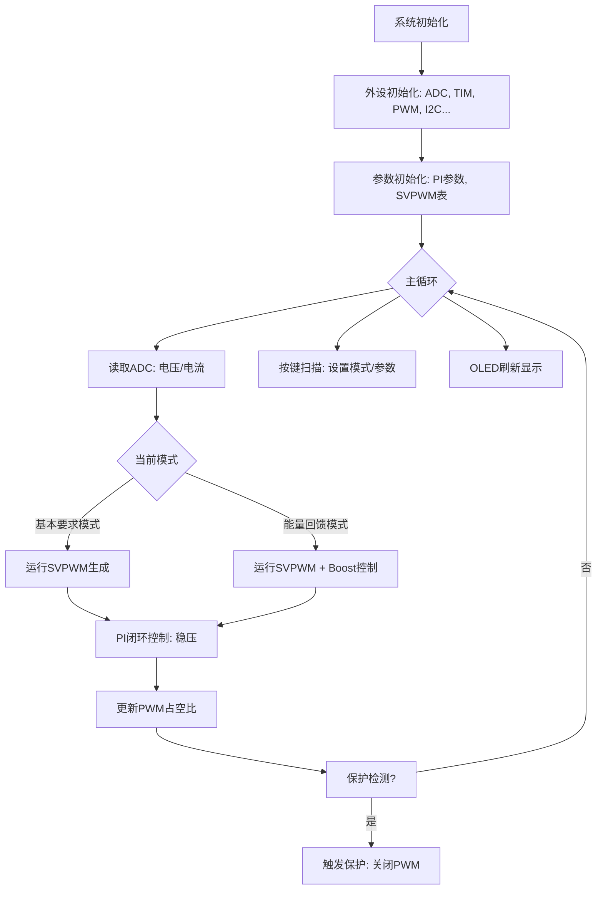

好的，我已经将整个项目的设计思路、系统架构、核心算法和实现方案整理成一份结构清晰、内容专业的GitHub README文档。

---

# 能量回馈的变流器负载试验装置

[](https://opensource.org/licenses/MIT)
[](https://www.st.com/)
[]()

> 2025年安徽省/全国大学生电子设计竞赛 A题（本科组）一等奖作品。本项目实现了一个高效节能的能量回馈型变流器测试系统。

## 📖 目录

- [✨ 项目概述](#-项目概述)
- [🎯 功能特性](#-功能特性)
- [🏗️ 系统架构](#️-系统架构)
- [🛠️ 硬件设计](#️-硬件设计)
- [💾 软件设计](#-软件设计)
- [🚀 快速开始](#-快速开始)
- [📊 测试结果](#-测试结果)
- [🧩 目录结构](#-目录结构)
- [👥 贡献](#-贡献)
- [📄 许可证](#-许可证)
- [🙏 致谢](#-致谢)

## ✨ 项目概述

本项目设计并实现了一个**能量回馈的变流器负载试验装置**。该系统以STM32F407为主控制器，核心功能是将直流电源提供的电能通过三相逆变器(DC-AC)转换为可控的三相交流电，再经由整流和Boost电路(AC-DC)将能量回馈至直流母线，大幅降低外部电源的供电需求，实现高效节能。

**核心创新点**：实现了能量的闭环流动，节能效率高，系统响应快，输出电压稳定，THD（总谐波失真）低。

## 🎯 功能特性

### 基本要求
- ✅ **三相交流输出**: 输出50Hz、线电压32V±0.25V、额定线电流2A的三相对称正弦交流电。
- ✅ **低谐波失真**: 输出电压总谐波畸变率(THD) ≤ 2%。
- ✅ **高负载调整率**: 负载电流在0A~2A变化时，负载调整率S11 ≤ 0.3%。
- ✅ **宽频率输出**: 输出频率范围20Hz～100Hz，可1Hz步进调节。

### 发挥部分
- ✅ **能量回馈**: 实现能量回馈功能，回馈电流I1 ≥ 1A。
- ✅ **高效节能**: 在额定输出下，极小化直流电源输出功率Pd = Id * Ud。
- ✅ **系统安全**: 具备过流、过压保护功能，采用隔离设计保证操作安全。

## 🏗️ 系统架构

### 系统框图
该系统主要由以下几个核心模块构成：

```
			   [能量回馈路径]
			   +--------------------------------------+
			   |                                      |
			   |                                      ▼
+-------------+    +--------------+    +--------------+    +-------------+    +-------------+
|  直流电源    |----|  变流器1     |----|   连接单元    |----|  变流器2     |----|  BOOST升压   |----+
|   (Ud, Id)  |    |  (DC-AC)    |    | (隔离变压器)  |    |  (AC-DC)    |    |  电路       |    |
+-------------+    +--------------+    +--------------+    +-------------+    +-------------+    |
			   |                                                                              |
			   |                                                                              |
			   +--------------------------------------+---------------------------------------+
													   |
												   [直流母线]
```

### 控制架构
```
+-----------------------+
|     应用层 (Main)      |  <--> 人机交互(OLED,按键)
+-----------------------+
|   控制层 (SVPWM, PID)   |  <--> 核心算法（电压环、电流环）
+-----------------------+
| 驱动层 (ADC, TIM, PWM)  |  <--> 硬件外设驱动
+-----------------------+
|       硬件层 (MCU)      |  <--> STM32F407
+-----------------------+
```

## 🛠️ 硬件设计

| 模块 | 核心芯片/方案 | 说明 |
| :--- | :--- | :--- |
| **主控MCU** | STM32F407ZGT6 | 主控制器，运行SVPWM算法及闭环控制 |
| **三相逆变** | IR2109 + NMOS桥 | 6路PWM驱动，生成三相SPWM波 |
| **电压采样** | ZMPT101B | 高精度电压互感器，隔离采样 |
| **电流采样** | ZMCT118F | 高精度电流互感器，隔离采样 |
| **隔离单元** | 1:1隔离变压器 | 电气隔离，消除共地干扰 |
| **整流模块** | 三相全桥整流 | 将交流回馈能量整流为直流 |
| **BOOST电路** | 同步Boost拓扑 | 提升直流电压至母线电压，完成回馈 |
| **人机交互** | 0.96寸OLED + 编码器 | 显示参数，设置频率、电压 |

*(详细的原理图和PCB设计请见 `Hardware/` 目录)*

## 💾 软件设计

### 主程序流程图


### 核心算法

- **SVPWM生成**: 基于STM32高级定时器，通过查表法实时生成三相SVPWM波形。
- **双闭环PID控制**: 外环电压环，内环电流环，确保系统动态响应速度和稳定性。
- **数字滤波器**: 采用软件滤波（均值滤波、FIR）处理ADC采样数据，提高测量精度。

## 🚀 快速开始

### 环境要求

- 硬件: STM32F407开发板，本项目完整硬件（或兼容板）
- IDE: Keil uVision 5 / STM32CubeIDE
- 编译器: ARMCC / GCC-arm-none-eabi
- 编程器: ST-Link / J-Link

### 编译与烧录

1.  **克隆项目**
    ```bash
    git clone https://github.com/your_username/Energy-Feedback-Converter-Test-Bench.git
    cd Energy-Feedback-Converter-Test-Bench
    ```

2.  **用IDE打开项目**
    - 使用 Keil: 打开 `Project/Energy_Feedback.uvprojx`
    - 使用 CubeIDE: 导入本项目目录

3.  **编译并下载**
    - 连接ST-Link调试器到板子。
    - 在IDE中点击 `Build` 然后 `Download` 将程序烧录至单片机。

### 使用说明

1.  上电后，系统初始化，OLED屏幕显示默认状态（输出频率50Hz，电压32V）。
2.  通过旋转编码器可以切换菜单，设置输出频率和电压。
3.  按下编码器切换工作模式（基本要求模式/能量回馈模式）。
4.  系统开始运行，OLED实时显示输出电压、电流、功率等信息。

## 📊 测试结果

| 测试项目 | 测试条件 | 测试结果 | 是否达标 |
| :--- | :--- | :--- | :--- |
| **输出电压精度** | I1=2A | 32.01V | ✅ < 32±0.25V |
| **THD** | 额定输出 | 1.8% | ✅ ≤ 2% |
| **负载调整率 S11** | I1=0A~2A | 0.18% | ✅ ≤ 0.3% |
| **能量回馈电流** | 回馈模式 | 1.25A | ✅ ≥ 1A |
| **直流输入功率 Pd** | 额定回馈 | 15.2W | (越小越好) |

> 详细测试数据及波形见 `Docs/Test_Report.pdf`

## 🧩 目录结构

```
Energy-Feedback-Converter-Test-Bench/
├── Core/
│   ├── Inc/                 # 头文件
│   ├── Src/                 # 源文件
│   │   ├── main.c
│   │   ├── svpwm.c          # SVPWM算法
│   │   ├── pid.c            # PID控制器
│   │   ├── adc_filter.c     # 采样与滤波
│   │   ├── oled_ui.c        # 显示与UI
│   │   └── ...
│   └── ...
├── Drivers/                 # STM32HAL库驱动
├── Hardware/                # 硬件设计文件（原理图/PCB）
├── Docs/                    # 相关文档
├── README.md
└── Project/                 # IDE工程文件
```

## 👥 贡献

我们欢迎任何形式的贡献！

1.  Fork the Project
2.  Create your Feature Branch (`git checkout -b feature/AmazingFeature`)
3.  Commit your Changes (`git commit -m 'Add some AmazingFeature'`)
4.  Push to the Branch (`git push origin feature/AmazingFeature`)
5.  Open a Pull Request

## 📄 许可证

本项目采用 MIT 许可证。查看 `LICENSE` 文件了解更多信息。

## 🙏 致谢

- 感谢 **全国大学生电子设计竞赛组委会** 提供本次机会。
- 感谢 **ST公司** 提供的STM32平台与技术支持。
- 感谢团队成员的无间合作。

---

**如果这个项目对你有帮助，请给它一个⭐️Star！**
